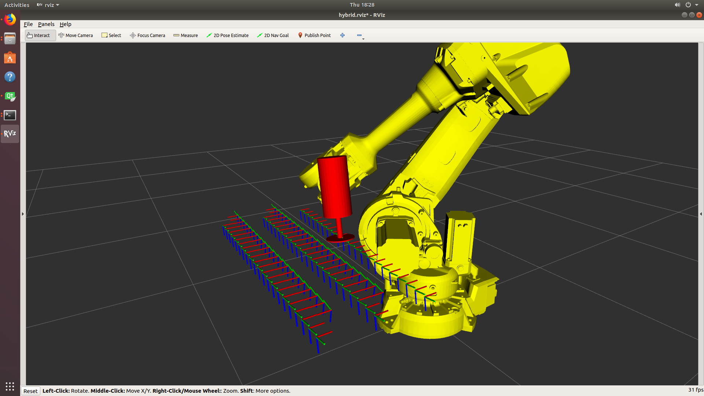
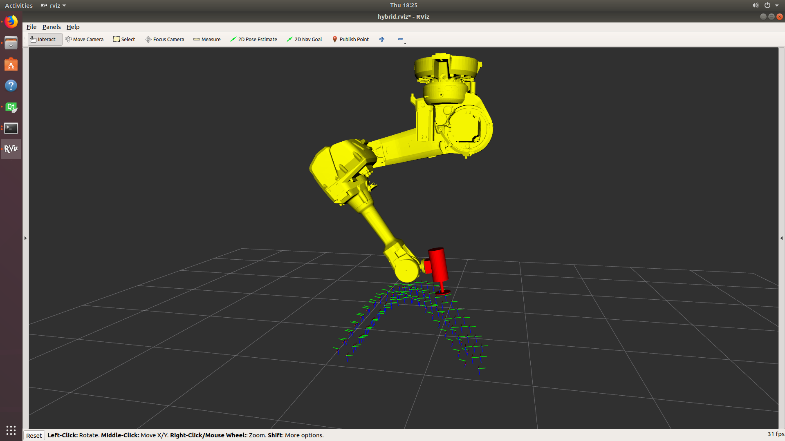
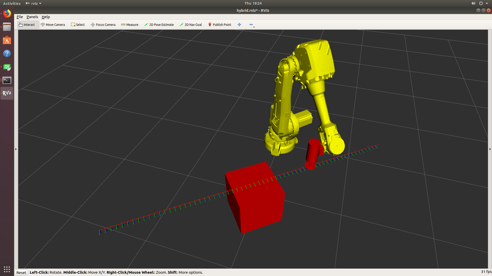
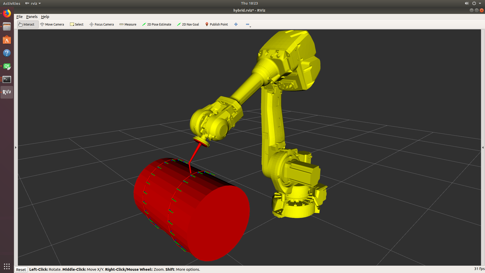

# Motion Planning Demos for Roscon 2018
## Using Sampling Planners & Optimization Together

## Installation

The current code is tested on ROS Melodic. First clone this repository and then use the
`hybrid.rosinstall` file to pull down the required dependencies. There are some extra
dependencies outside of the catkin packages, such as python-catkin-tools and python-wstool.

```bash
# Make a ROS WS and cd into the src/ folder
git clone https://github.com/Jmeyer1292/hybrid_planning_experiments.git

# Use rosinstall to pull dependencies
wstool init .
wstool merge hybrid_planning_experiments/hybrid.rosinstall
wstool update

# Build the workspace (do it in Release or RelWithDebInfo)
catkin build --cmake-args -DCMAKE_BUILD_TYPE=Release
```

## Running
The packages are organized into "workcells" each with its own geometry. To run the demo in `workcell1`:

```bash
# In terminal 1
roslaunch workcell1_support simulation.launch

# In terminal 2 (and then configure it)
rosrun rviz rviz -d src/hybrid_planning_experiments/hybrid.rviz

# In terminal 3
rosrun workcell1_demos workcell1_demo
```

To visualize, you can load the RVIZ config `hybrid.rviz` in the root of this repo.

The other demos follow suit; just replace `workcell1` with `workcell2` or `workcell3`, etc...

## Demonstrations

### Workcell 1 (Static robot arm & sander)


The robot arm takes several passes back and forth sanding the "table" in front of it. This is basic but:
 1. The tool is free to rotate around Z (and it needs to because it's so close to the robot)
 2. The paths are planned independently

### Workcell 2 (Gantry robot arm & sander)


This demo mimics the first demo, but the robot is on a gantry now. The whole process has 8 + 1 = 9 DOF.

### Workcell 3 (Static robot arm, turn table & sander)


In this demo, the robot is trying to run its sander along a very long part and needs to move the central turn
table to make this happen.

### Workcell 4 (Static robot arm, barrel & welder) *ROSCON 2018


In this demo, the robot wants to smoothly run its weld gun along the body of this barrel.
